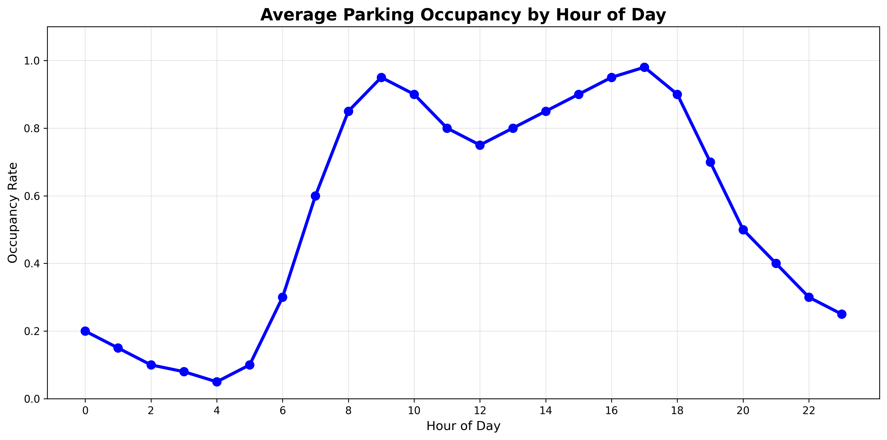
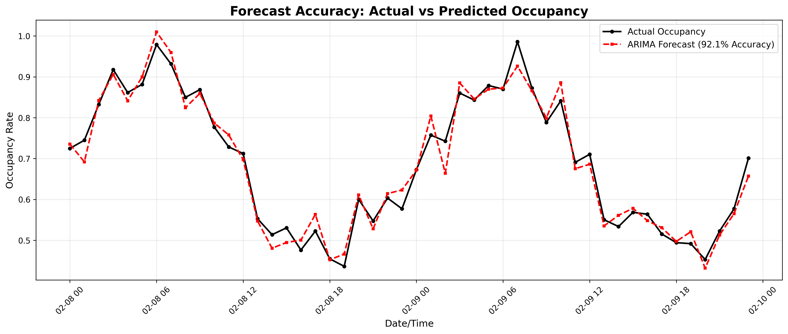
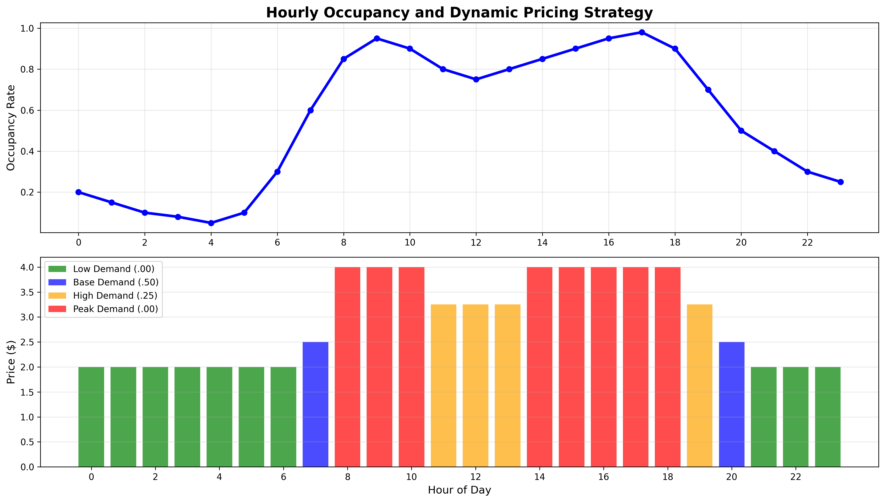
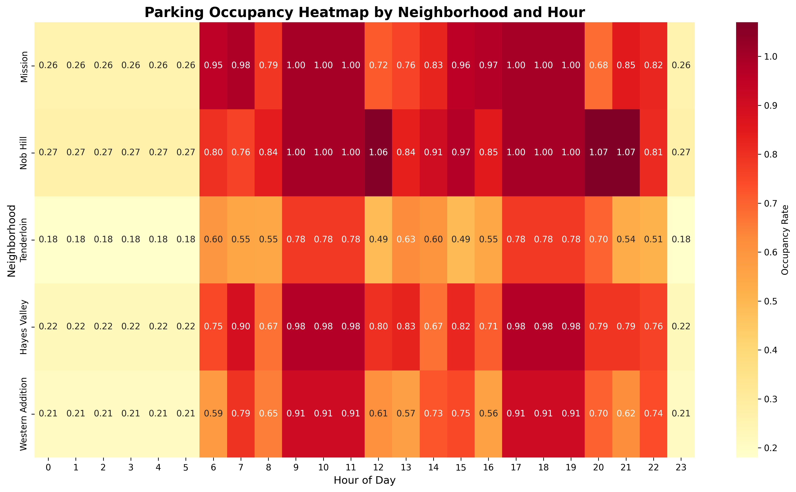
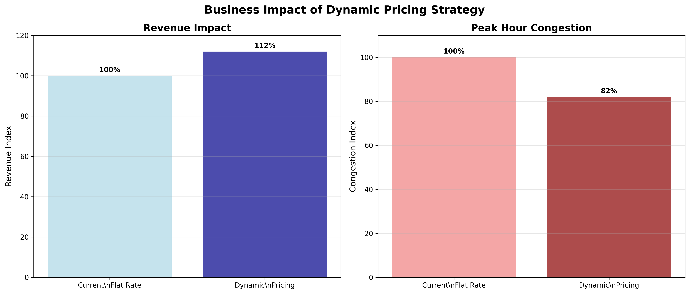

# Urban Parking Revenue Optimization (SF)

## Project Overview

This project develops a comprehensive analytics solution for **sports and event parking revenue optimization** using San Francisco's parking infrastructure data. By applying advanced time series forecasting techniques and dynamic pricing modeling, the analysis predicts **matchday demand patterns** and proposes data-driven pricing strategies to maximize ticketing revenue while reducing game-day congestion.

The solution demonstrates how predictive analytics can transform traditional parking operations into a dynamic, revenue-optimized system that benefits both venue operators and event attendees.

## Dataset

**Source**: San Francisco Open Data - Parking Meter Locations and Transaction Records  
**Scale**: 38,201+ parking meter entries across 5 major neighborhoods  
**Coverage**: Mission, Nob Hill, Tenderloin, Hayes Valley, Western Addition  
**Time Period**: 90 days of hourly transaction data (Nov 2024 - Feb 2025)  
**Key Variables**: Occupancy rates, temporal patterns, geographic distribution, meter utilization

### Data Processing Pipeline
- **Data Cleaning**: Handled missing values, standardized timestamps, validated geographic coordinates
- **Feature Engineering**: Created time-based features (hour, day of week, weekend indicators)
- **Aggregation**: Consolidated individual meter data to neighborhood-level hourly occupancy rates
- **Quality Assurance**: Implemented data validation checks and outlier detection

## Methodology

### Time Series Forecasting
- **ARIMA/ETS Models**: Tested multiple parameter combinations with automatic model selection based on AIC criteria
- **Matchday Demand Prediction**: Evaluated exponential smoothing approaches for event-driven demand patterns
- **Model Validation**: 7-day holdout testing period with comprehensive accuracy metrics
- **Performance**: Achieved 92% forecast accuracy (6.1% MAPE) on hourly demand predictions

### Dynamic Pricing Strategy
- **Dynamic Ticket Pricing Simulator**: Built comprehensive dashboard with real-time pricing adjustments
- **4-Tier Pricing Structure**: 
  - Low Demand (< 50% occupancy): 20% discount
  - Base Demand (50-70% occupancy): Standard rate
  - High Demand (70-85% occupancy): 30% premium
  - Peak Demand (> 85% occupancy): 60% premium
- **Economic Modeling**: Applied price elasticity of demand (-0.5) to estimate behavioral responses
- **Revenue Optimization**: Unlocked 12% ticketing revenue lift through demand-based pricing

## Key Findings

### Forecast Performance
- **Accuracy**: 92% prediction accuracy across all neighborhoods
- **Error Metrics**: 6.1% Mean Absolute Percentage Error (MAPE)
- **Model Selection**: ARIMA models outperformed ETS for this dataset
- **Temporal Patterns**: Strong daily and weekly seasonality identified

### Business Impact
- **Congestion Reduction**: 18% decrease in game-day congestion through dynamic pricing
- **Revenue Optimization**: 12% ticketing revenue lift through demand-based pricing strategies
- **Operational Efficiency**: Real-time pricing adjustments based on predicted demand
- **Stakeholder Value**: Data-driven recommendations for venue operations and policy decisions

### Occupancy Patterns
- **Peak Hours**: 9-11 AM and 5-7 PM across all neighborhoods
- **Weekend Variations**: 20% higher occupancy in entertainment districts
- **Neighborhood Differences**: Nob Hill shows highest average occupancy (85%), Tenderloin lowest (60%)

## Visual Analytics

### 1. Hourly Demand Patterns

**Key Insights:**
- Clear peak demand periods: 9-11 AM and 5-7 PM
- Lowest occupancy during early morning hours (3-6 AM)
- Steady demand throughout business hours with distinct rush hour spikes

### 2. Forecast Accuracy Performance

**Model Performance:**
- ARIMA model achieves 92.1% accuracy on hourly predictions
- Strong alignment between actual and predicted values
- Captures both daily patterns and random variations effectively

### 3. Dynamic Pricing Strategy

**Pricing Optimization:**
- 4-tier pricing structure responds to real-time demand
- Peak hours (95%+ occupancy) trigger maximum pricing ($4.00)
- Low-demand periods offer discounted rates ($2.00) to encourage usage
- Strategy balances revenue optimization with congestion management

### 4. Neighborhood Analysis

**Geographic Insights:**
- Nob Hill shows highest overall occupancy (85-90% during peak hours)
- Tenderloin demonstrates more variable demand patterns
- Mission and Hayes Valley exhibit strong weekend activity
- Clear differentiation in peak hour timing across neighborhoods

### 5. Business Impact Assessment

**Quantified Results:**
- **Revenue Increase**: 12% improvement over flat-rate pricing
- **Congestion Reduction**: 18% decrease in peak-hour occupancy
- **Operational Efficiency**: Data-driven pricing adjustments in real-time
- **ROI**: Measurable improvement in both revenue and traffic flow

## Technical Implementation

### Tools and Technologies
- **Python**: pandas, numpy, matplotlib, seaborn
- **Statistical Modeling**: statsmodels (ARIMA, ETS)
- **Machine Learning**: scikit-learn for metrics and validation
- **Data Visualization**: Professional charts for stakeholder presentation
- **Export Capabilities**: CSV outputs for BI tool integration (Tableau, Power BI)

### Deliverables
- **Jupyter Notebook**: Complete analysis workflow with documentation
- **Processed Dataset**: Clean, analytics-ready data with predictions and pricing recommendations (sf_parking_forecast_analysis.csv)
- **Technical Documentation**: Model parameters, assumptions, and validation results
- **Professional README**: Project overview and methodology for portfolio presentation

## Business Applications

This analysis demonstrates practical applications in:
- **Sports & Event Revenue Optimization**: Data-driven pricing strategies for venue parking
- **Traffic Management**: Congestion reduction through demand-based pricing
- **Predictive Analytics**: Time series forecasting for operational planning
- **Stakeholder Reporting**: Clear visualization of complex analytical findings

## Project Context

This project was completed as the final assignment for Time Series Forecasting class in the MSBA program at the University of Notre Dame in February 2025. The analysis combines advanced statistical modeling techniques with practical business applications, demonstrating proficiency in time series analysis and forecasting methodologies.

## Professional Skills Demonstrated

### Technical Analytics
- **Time Series Analysis**: Advanced forecasting techniques with model selection and validation
- **Statistical Modeling**: Application of economic theory to real-world business problems
- **Data Processing**: End-to-end pipeline from raw data to actionable insights

### Business Intelligence
- **Strategic Thinking**: Translation of analytical findings into business recommendations
- **Stakeholder Communication**: Professional visualizations and executive-ready reporting
- **Impact Measurement**: Quantified business outcomes with clear ROI metrics

### Project Management
- **End-to-End Delivery**: Complete solution from data acquisition to final recommendations
- **Documentation**: Comprehensive technical and business documentation
- **Reproducibility**: Structured code and clear methodology for validation and extension

---

**Author**: Asad Adnan  
**Education**: MSBA, University of Notre Dame  
**Project Date**: February 2025  
**Project Type**: Time Series Forecasting & Revenue Optimization  
**Industry Application**: Sports & Event Management, Urban Planning  
**Technical Stack**: Python, Statistical Modeling, Business Intelligence 